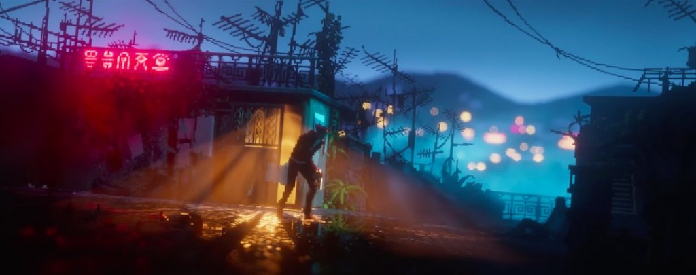
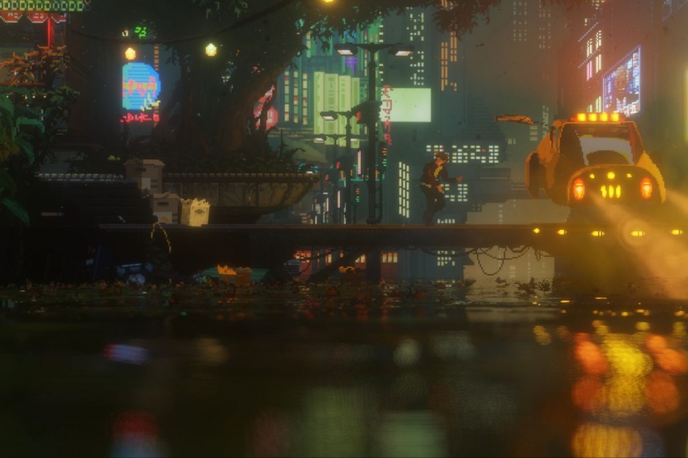
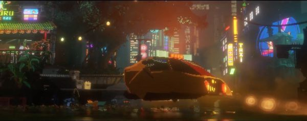
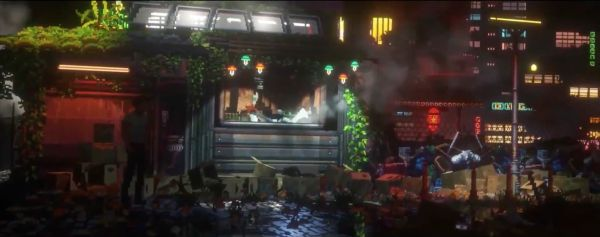
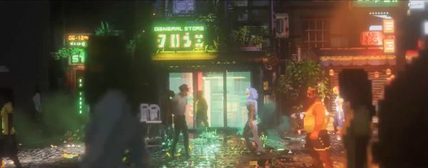
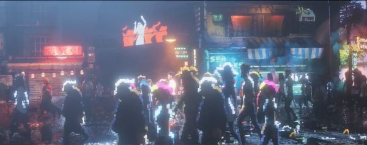
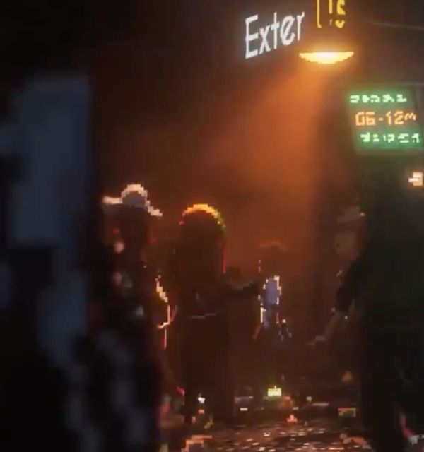
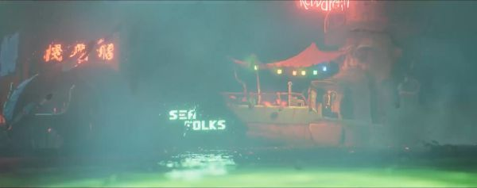
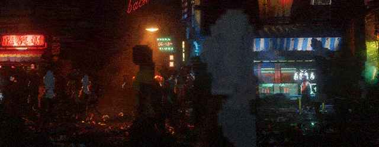
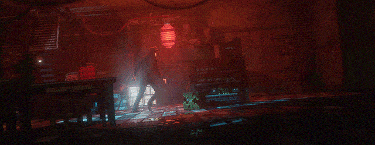

# The Last Night 风格指南：2.5D Filmic Pixel Art

> 配套实测数据：`references/the-last-night-visual-analysis.md`
> （10 张官方参考图的亮度分布/色相占比/高光色实测值 + 可复现的验收脚本）
> 参考图与验收脚本在 `references/the-last-night/`。

## 核心理念

**"Low-fi assets, hi-fi rendering"**
— 像素画是"低精度资产"，渲染管线是现代 3D 级别。两者结合产生独特的赛博朋克电影感。

创始人 Tim Soret 的背景是动态设计（motion design），不是传统像素画师。这决定了 The Last Night 的美术方向：**用电影语言做像素游戏**。

## 视觉特征清单

| 特征 | 实现方式 | 传统像素画对比 |
|------|---------|---------------|
| **Big Pixel Style** | 像素 sprite 在高分辨率下渲染，每个源像素由数十个显示像素组成 | 传统锁定在低分辨率网格 |
| **自由摄像机** | 摄像机可倾斜、平移、推拉，不受网格对齐限制 | 传统固定正交视角 |
| **100% 动态光照** | 延迟渲染(Deferred)，数千盏体积光+投射阴影，全部实时 | 传统靠手绘明暗 |
| **景深(DOF)** | 前景/背景模糊，产生 bokeh 光斑效果 | 传统无景深 |
| **体积雾/God Rays** | 大气散射+体积光穿过雾气 | 传统无 |
| **实时反射** | 地面是真 3D 几何体（非 2D 图片），支持反射 | 传统地面是 tilemap |
| **实时天气** | 雨水浸润表面+动态干燥，风力影响粒子 | 传统无或帧动画模拟 |
| **昼夜循环** | 全局光照随时间变化 | 传统固定色调 |
| **3D 物理物体** | 地面上的箱子等是 3D 物体，受光照和物理引擎影响 | 传统是 2D sprite |
| **折射效果** | 窗户玻璃、雨滴折射背景图像 | 传统无 |
| **电影宽银幕比例** | 官方素材实测 **2.53:1**（比 21:9 更宽）；仅为取景习惯，非强制 | 传统 16:9 或 4:3 |

## 场景构成层次

```
┌─────────────────────────────────────────┐
│  [最远] 3D 天空盒 / 远景建筑 sprite     │  ← 极低饱和度，大气透视
│  [远景] 2D billboard 建筑群              │  ← 景深模糊(bokeh)
│  [中景] 2D sprite + 法线贴图 + 体积光   │  ← 主要可视区域
│  [前景] 3D 地面几何体(可反射)            │  ← 真 3D，不是 tilemap
│  [角色] 2D pixel sprite (billboard)      │  ← 手绘像素，16-32px 高
│  [叠加] 体积雾 / 雨滴 / 粒子 / 光晕    │  ← 后处理层
│  [最前] 景深前景模糊 + UI               │
└─────────────────────────────────────────┘
```

关键点：**垂直面用 2D billboard sprite，水平面用 3D 几何体**。这样垂直面保持像素质感，水平面能做反射和物理。

## 参考图速览

| | |
|---|---|
| <br>**01** 山坡棚屋：红霓虹 + 门内体积光 + 湿地反射 + 青雾景深 | <br>**02** 街道悬浮车：下 1/3 失焦水面 bokeh |
| <br>**03** 单一暖光源主导整帧 | <br>**04** 藤蔓压科技 + 蒸汽 + 前景剪影挡边 |
| <br>**05** 招牌绿作第二色，人群三层纵深 | <br>**06** 雾抬黑场：全图无纯黑 |
| <br>**07** 极端前景虚化 | <br>**08** 雾主导，饱和度最低 |
| <br>**anim-01** 街头人群（摄像机持续运动） | <br>**anim-02** 室内枪战（98% 单色相） |

每张图的实测亮度/色相/高光数值见 `the-last-night-visual-analysis.md`。

## 灵感来源

Tim Soret 明确提到的参考：
- **银翼杀手 (Blade Runner)** — 霓虹雨夜、赛博朋克城市氛围
- **攻壳机动队 (Ghost in the Shell)** — 未来都市、科技与人文
- **香港城市景观** — 密集的霓虹招牌、狭窄巷道、层叠建筑
- **Flashback (1992)** — cinematic platformer 的动画风格
- **Another World (1991)** — 电影化叙事 + 简洁视觉
- **Oddworld: Abe's Oddysee** — 2.5D 场景深度感
- **Gods Will Be Watching / Sword & Sworcery** — 像素角色风格起点（细长腿角色易于动画）

## 调色板特征

| 场景类型 | 主色调 | 辅色 | 强调色 | 氛围 |
|---------|--------|------|--------|------|
| 雨夜街道 | 深蓝黑 #0A0E1A | 冷灰蓝 #1E2D3D | 霓虹粉 #FF2D7B / 霓虹青 #00F0FF | 潮湿、孤独 |
| 室内公寓 | 暖橙褐 #3A2518 | 深棕 #1C1008 | 暖黄灯光 #FFD080 | 私密、温暖 |
| 高层天台 | 暗紫蓝 #1A1040 | 灰紫 #3A2D5A | 远处城市橙光 #FF8844 | 空旷、反思 |
| 地下通道 | 纯黑 #080808 | 深绿 #0A1A10 | 红色警示灯 #FF3030 | 压抑、危险 |
| 白天街道 | 灰蓝 #8A9AB0 | 浅米 #D8D0C0 | 绿植 #4A8040 | 日常、后赛博朋克 |

特征：**高对比度 + 极低环境光 + 点状强光源（霓虹/路灯/屏幕）**。暗部极暗，亮部极亮。

> 上表是按场景类型归纳的设计用色。参考图里**实测**出来的高光色更窄（钠灯橙 `#C06020`–`#E0A040`、
> 霓虹青 `#00A0C0`–`#4080C0`、灯笼红 `#C02020`–`#E04040`、招牌绿 `#80C080`–`#A0E080`），
> 且没有一个到达纯白 —— 见 `the-last-night-visual-analysis.md` 第 3 条。

## AI 辅助实现指南

### Prompt 模板（生成场景概念图）

```
2.5D cinematic pixel art scene, The Last Night style,
[场景描述], cyberpunk city at night,
low-fi pixel sprites with hi-fi volumetric lighting,
neon signs reflecting on wet ground, atmospheric fog,
depth of field with bokeh highlights, ultra-wide cinematic aspect ratio,
dynamic colored lighting (neon pink and cyan),
dark moody atmosphere, rain particles,
pixel art characters as 2D billboards in 3D environment
```

**负面 prompt**：
```
bright overall lighting, flat lighting, retro 8-bit,
cartoonish, clean/sterile environment, daytime sunny,
uniform pixel grid, no depth, no atmospheric effects
```

### Prompt 模板（生成角色 sprite）

```
pixel art character sprite, 24-32px tall,
thin elongated legs (The Last Night / Flashback style),
dark silhouette with rim lighting from neon signs,
minimal detail, readable pose,
transparent background, side view
```

### 在游戏引擎中实现的技术要点

#### Unity 实现路径
1. **渲染管线**：使用 URP 或 HDRP 的 Deferred Rendering
2. **Sprite 处理**：
   - 角色/建筑竖面 → SpriteRenderer (billboard)
   - 给 sprite 添加 Normal Map 以响应动态光照
   - 使用 Sprite Lit/Unlit 材质
3. **地面**：3D Mesh + 反射探针或 SSR (Screen Space Reflections)
4. **光照**：
   - 大量 Point Light / Spot Light（霓虹色）
   - 体积光(Volumetric Lighting) 需要 HDRP 或第三方插件
   - 完全不烘焙，所有光源实时
5. **后处理**：
   - Depth of Field（散景模式）
   - Bloom（泛光，让霓虹灯溢出）
   - Color Grading（压暗暗部，拉高对比）
   - Film Grain + Vignette（电影质感）
   - Chromatic Aberration（轻微色差）
6. **天气**：粒子系统做雨滴 + Shader 做表面湿润效果
7. **摄像机**：允许轻微倾斜和平移，不锁定像素网格

#### Godot 实现路径
1. **渲染**：Godot 4 Forward+ 或 Mobile 渲染器
2. **2D 在 3D 中**：使用 Sprite3D 节点作为 billboard
3. **光照**：OmniLight3D / SpotLight3D + VolumetricFog
4. **地面**：MeshInstance3D + 反射
5. **后处理**：WorldEnvironment 节点配置 Glow/DOF/Tonemap
6. **摄像机**：Camera3D 带 DOF + 电影宽银幕裁切

### 关键约束（避免"不像"）

- ❌ **不要**让所有像素完美对齐网格 — The Last Night 的精髓是像素在高分辨率下自由旋转
- ❌ **不要**用均匀环境光 — 暗部要极暗，光源要有明确方向和颜色
- ❌ **不要**只做 2D — 地面必须是 3D 才能做反射
- ❌ **不要**忽略大气效果 — 雾气和体积光是氛围的一半
- ✅ **要**用电影构图 — 宽银幕、前景遮挡、景深分层
- ✅ **要**让光源有颜色 — 每盏灯都有性格（粉/青/橙/红）
- ✅ **要**保持 sprite 本身简洁 — 低精度资产是前提，复杂度来自渲染

## 参考链接

- Tim Soret IGN Making-of（视频）: 搜索 "Journey to The Last Night IGN First"
- Odd Tales 官方博客: <https://oddtales.net/blog/topics/thelastnight/>
- Retronator 技术拆解: <https://medium.com/retronator-magazine/the-future-of-pixel-art-with-the-last-night-a9a4eb61e824>
- Tim Soret《Mechanics vs Worldbuilding》: <https://oddtales.net/blog/2016-juicing-a-mechanic-vs-building-a-world>
- 游戏架构分享(RGB Conference): <https://oddtales.net/blog/2024-the-last-night-game-architecture>
