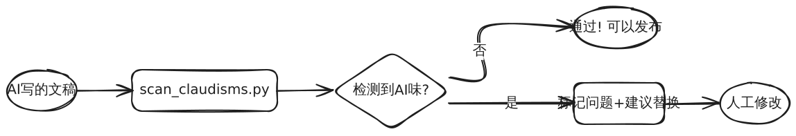

# writing-deai ✍️

**一键扫描 AI 写作痕迹，让你的文章不再一眼 GPT。**



## 它解决什么问题？

你用 AI 写了一篇文章，自己读着觉得挺顺。发出去 —— 评论区第一条：

> "一眼 AI 写的"

问题不在内容对不对，而在**味道对不对**。AI 有一套根深蒂固的"语言习惯"（[claudisms](https://claudisms.ai)），人类读者对此已经形成免疫。

### 一眼 AI 的典型症状

```
❌ In today's rapidly evolving AI landscape, it is worth noting that
   this transformative technology represents a paradigm shift...

❌ 在当今快速发展的AI时代，值得一提的是，这项颠覆性的技术
   正在重新定义行业格局...

❌ It's not about the technology — it's about the people.
   （"不是A，而是B" —— 公认第一AI指纹）
```

## 扫描效果演示

输入一段典型 AI 文本：

```
In today's rapidly evolving AI landscape, it is worth noting that this
transformative technology represents a paradigm shift. The most interesting
part is how it seamlessly leverages robust holistic approaches to navigate
the complex realm of innovation.

This matters because at the end of the day, it's not about the technology
— it's about the people.
```

运行扫描：

```bash
$ python3 scripts/scan_claudisms.py article.md
```

输出：

```
⚠️ 检测到 13 处 AI 写作痕迹

### 企业黑话 (5处)
  L1: "robust" → 用 strong/solid/reliable
  L1: "seamlessly" → 用 smooth/easy
  L1: "holistic" → 用 whole/complete
  L1: "navigate" → 用 handle/deal with/work through
  L1: "paradigm shift" → 用具体描述变了什么

### 空洞宣告 (3处)
  L1: "it is worth noting" → 删掉，直接说内容
  L1: "The most interesting part" → 删掉修饰，直接说内容
  L3: "This matters" → 删掉，让内容自己说话

### 陈词滥调 (3处)
  L1: "transformative" → 用具体描述变了什么
  L1: "realm" → 用 area/field/domain
  L3: "at the end of the day" → 删掉

### [结构] 宏大开场 (1处)
  L1: "In today's rapidly evolving" → 删掉，直接入题

### [结构] Em dash (1处)
  L3: "—" → 用 - (空格短横空格) 代替

---
总计: 13 处 | 分类: 5 类
重灾区: 企业黑话(5), 空洞宣告(3), 陈词滥调(3)
```

修改后：

```
✅ AI 这波技术进步改变了什么？不是算力上了一个台阶那么简单 - 
   是工程师写代码的方式从根上变了。
   
   具体来说：XXX 场景下，以前要三天的工作现在 20 分钟跑完。
```

**13处AI味 → 0处。内容没变，味道完全不同。**

## 快速使用

```bash
# 扫描文件
python3 scripts/scan_claudisms.py your_article.md

# 管道输入
cat draft.md | python3 scripts/scan_claudisms.py -

# JSON 格式输出（方便程序处理）
python3 scripts/scan_claudisms.py your_article.md --json
```

## 检测覆盖范围

| 类别 | 示例 | 数量 |
|------|------|------|
| 🏢 企业黑话 | leverage, robust, seamless, navigate, holistic | 16+ |
| 💨 空洞宣告 | worth noting, this matters, the interesting part | 7+ |
| 🎭 伪深沉 | sit with, surface, naming, hold tension | 14+ |
| 📢 虚假强调 | the whole game, most people, hits hardest | 8+ |
| 😘 虚假亲密 | can't stop thinking, hit a nerve, stayed with me | 5+ |
| 🎬 过度戏剧化 | quietly shift, we've seen this movie | 2+ |
| 🔬 伪科学比喻 | the physics of, compounds over time | 3+ |
| 📜 陈词滥调 | at the end of the day, groundbreaking, delve | 12+ |
| 🇨🇳 中文AI味 | 值得一提、众所周知、在当今...时代、随着...发展 | 7+ |
| 🧱 结构问题 | 负面平行、宏大开场、路标过渡、em dash | 9+ |

## 它不做什么

- ❌ 不自动改写 —— 只标记问题，修改靠你
- ❌ 不是所有命中都必须改 —— 有些词在特定语境下合理
- ❌ 不替代人的判断 —— 脚本抓词汇和结构，但"像不像人写的"最终靠人感觉

## 人工检查清单（脚本扫不到的）

跑完脚本后，再过一遍这些：

1. **Cool people rule** —— 内容是在"宣布自己重要"还是"用内容证明"？
2. **虚构观察** —— 有没有"大多数人"类的无源断言？
3. **戏剧化程度** —— 动词力度是否匹配实际影响？
4. **结构单调** —— 是否连续4+短句？每段节奏相同？
5. **加冕最高级** —— 有没有"最重要的是"式单峰宣告？

## 适用场景

- 📻 播客口播稿自检
- 📝 知乎/小红书文案去AI感
- 📧 正式邮件/报告发布前
- 🌐 任何要发到公开平台的文字

## 安装

零依赖，纯 Python 3 标准库。Clone 下来直接跑：

```bash
git clone <repo>
cd writing-deai
python3 scripts/scan_claudisms.py your_file.md
```

## 禁词表来源

基于 [claudisms.ai](https://claudisms.ai) 的公开禁词表，并补充了中文常见AI味词汇。持续更新中。

## License

MIT
